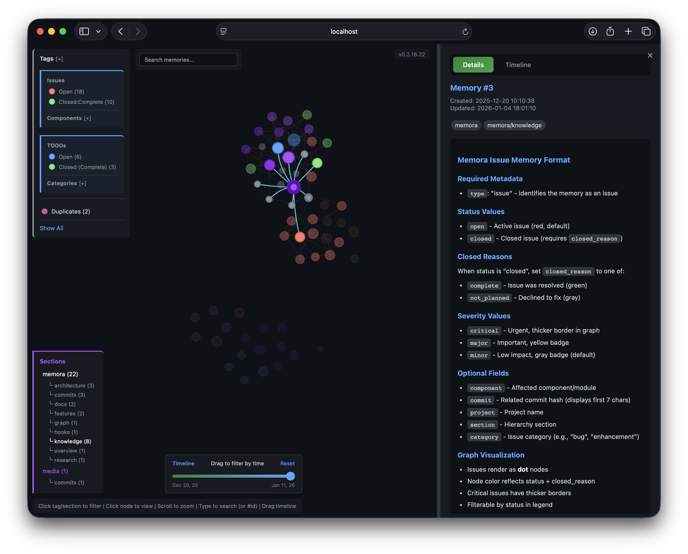
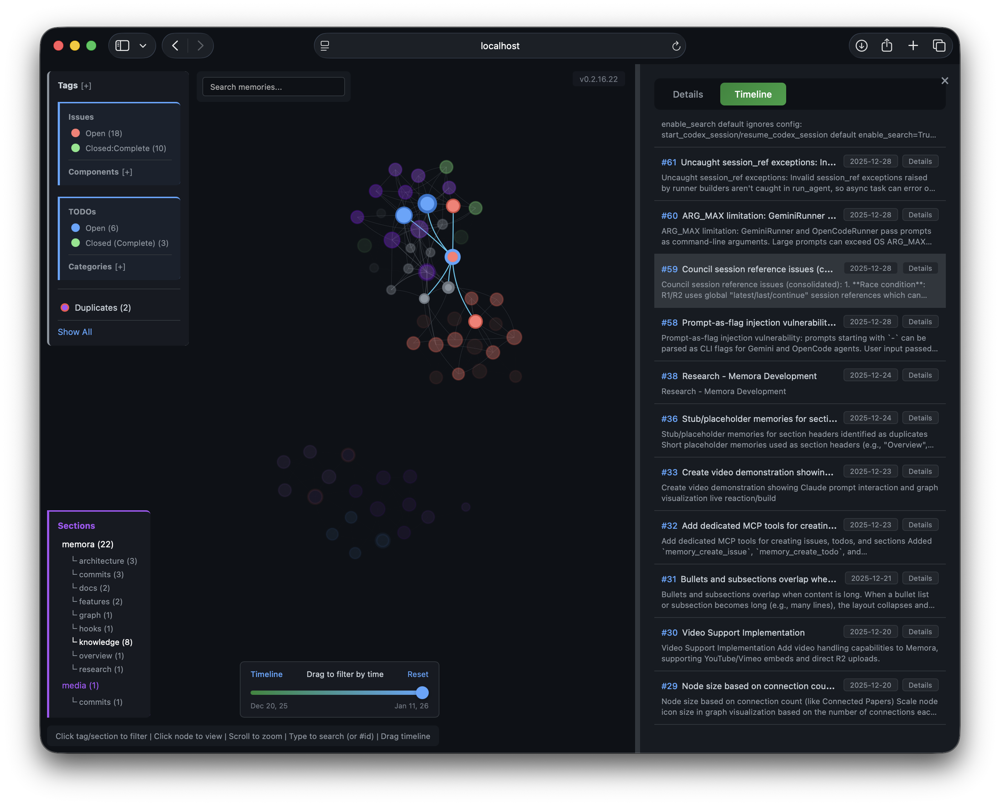

<h1 align="center"> <font size="7">Memora</font></h1>

<p align="center">
<b>Give your AI agents persistent memory</b><br>
A lightweight MCP server for semantic memory storage, knowledge graphs, and cross-session context.
</p>

<p align="center">
<a href="https://github.com/agentic-mcp-tools/memora/releases"></a>
<a href="LICENSE"></a>
<a href="https://github.com/thedotmack/awesome-claude-code"></a>
</p>

<p align="center">

</p>

<p align="center">
<b><a href="#features">Features</a></b> · <b><a href="#install">Install</a></b> · <b><a href="#usage">Usage</a></b> · <b><a href="#claude-code-config">Config</a></b> · <b><a href="#live-graph-server">Live Graph</a></b> · <b><a href="#semantic-search--embeddings">Semantic Search</a></b> · <b><a href="#llm-deduplication">LLM Deduplication</a></b>
</p>

## Features

- 💾 **Persistent Storage** - SQLite-backed database with optional cloud sync (S3, GCS, Azure)
- 🔍 **Semantic Search** - Vector embeddings (TF-IDF, sentence-transformers, or OpenAI)
- 🤖 **LLM Deduplication** - Find and merge duplicate memories with AI-powered comparison
- ⚡ **Memory Automation** - Structured tools for TODOs, issues, and section placeholders
- 🔗 **Memory Linking** - Typed edges, importance boosting, and cluster detection
- 📡 **Event Notifications** - Poll-based system for inter-agent communication
- 🎯 **Advanced Queries** - Full-text search, date ranges, tag filters (AND/OR/NOT)
- 🔀 **Cross-references** - Auto-linked related memories based on similarity
- 📂 **Hierarchical Organization** - Explore memories by section/subsection
- 📦 **Export/Import** - Backup and restore with merge strategies
- 🕸️ **Knowledge Graph** - Interactive HTML visualization with Mermaid diagram rendering
- 🌐 **Live Graph Server** - Auto-starts HTTP server for remote access via SSH
- 📊 **Statistics & Analytics** - Tag usage, trends, and connection insights

## Install

```bash
pip install git+https://github.com/agentic-mcp-tools/memora.git
```

Includes cloud storage (S3/R2) and OpenAI embeddings out of the box.

```bash
# Optional: local embeddings (offline, ~2GB for PyTorch)
pip install "memora[local]" @ git+https://github.com/agentic-mcp-tools/memora.git
```

## Usage

The server runs automatically when configured in Claude Code. Manual invocation:

```bash
# Default (stdio mode for MCP)
memora-server

# With graph visualization server
memora-server --graph-port 8765

# HTTP transport (alternative to stdio)
memora-server --transport streamable-http --host 127.0.0.1 --port 8080
```

## Claude Code Config

Add to `.mcp.json` in your project root:

### Local DB
```json
{
  "mcpServers": {
    "memora": {
      "command": "memora-server",
      "args": [],
      "env": {
        "MEMORA_DB_PATH": "~/.local/share/memora/memories.db",
        "MEMORA_ALLOW_ANY_TAG": "1",
        "MEMORA_GRAPH_PORT": "8765"
      }
    }
  }
}
```

### Cloud DB (S3/R2)
```json
{
  "mcpServers": {
    "memora": {
      "command": "memora-server",
      "args": [],
      "env": {
        "AWS_PROFILE": "memora",
        "AWS_ENDPOINT_URL": "https://<account-id>.r2.cloudflarestorage.com",
        "MEMORA_STORAGE_URI": "s3://memories/memories.db",
        "MEMORA_CLOUD_ENCRYPT": "true",
        "MEMORA_ALLOW_ANY_TAG": "1",
        "MEMORA_GRAPH_PORT": "8765"
      }
    }
  }
}
```

## Codex CLI Config

Add to `~/.codex/config.toml`:

```toml
[mcp_servers.memora]
  command = "memora-server"  # or full path: /path/to/bin/memora-server
  args = ["--no-graph"]
  env = {
    AWS_PROFILE = "memora",
    AWS_ENDPOINT_URL = "https://<account-id>.r2.cloudflarestorage.com",
    MEMORA_STORAGE_URI = "s3://memories/memories.db",
    MEMORA_CLOUD_ENCRYPT = "true",
    MEMORA_ALLOW_ANY_TAG = "1",
  }
```

## Environment Variables

| Variable               | Description                                                                 |
|------------------------|-----------------------------------------------------------------------------|
| `MEMORA_DB_PATH`       | Local SQLite database path (default: `~/.local/share/memora/memories.db`)  |
| `MEMORA_STORAGE_URI`   | Cloud storage URI for S3/R2 (e.g., `s3://bucket/memories.db`)              |
| `MEMORA_CLOUD_ENCRYPT` | Encrypt database before uploading to cloud (`true`/`false`)                |
| `MEMORA_CLOUD_COMPRESS`| Compress database before uploading to cloud (`true`/`false`)               |
| `MEMORA_CACHE_DIR`     | Local cache directory for cloud-synced database                            |
| `MEMORA_ALLOW_ANY_TAG` | Allow any tag without validation against allowlist (`1` to enable)         |
| `MEMORA_TAG_FILE`      | Path to file containing allowed tags (one per line)                        |
| `MEMORA_TAGS`          | Comma-separated list of allowed tags                                       |
| `MEMORA_GRAPH_PORT`    | Port for the knowledge graph visualization server (default: `8765`)        |
| `MEMORA_EMBEDDING_MODEL` | Embedding backend: `tfidf` (default), `sentence-transformers`, or `openai` |
| `SENTENCE_TRANSFORMERS_MODEL` | Model for sentence-transformers (default: `all-MiniLM-L6-v2`)        |
| `OPENAI_API_KEY`       | API key for OpenAI embeddings and LLM deduplication                        |
| `OPENAI_BASE_URL`      | Base URL for OpenAI-compatible APIs (OpenRouter, Azure, etc.)              |
| `OPENAI_EMBEDDING_MODEL` | OpenAI embedding model (default: `text-embedding-3-small`)               |
| `MEMORA_LLM_ENABLED`   | Enable LLM-powered deduplication comparison (`true`/`false`, default: `true`) |
| `MEMORA_LLM_MODEL`     | Model for deduplication comparison (default: `gpt-4o-mini`)                |
| `AWS_PROFILE`          | AWS credentials profile from `~/.aws/credentials` (useful for R2)          |
| `AWS_ENDPOINT_URL`     | S3-compatible endpoint for R2/MinIO                                        |
| `R2_PUBLIC_DOMAIN`     | Public domain for R2 image URLs                                            |

## Semantic Search & Embeddings

Memora supports three embedding backends:

| Backend | Install | Quality | Speed |
|---------|---------|---------|-------|
| `openai` (default) | Included | High quality | API latency |
| `sentence-transformers` | `pip install memora[local]` | Good, runs offline | Medium |
| `tfidf` | Included | Basic keyword matching | Fast |

**Automatic:** Embeddings and cross-references are computed automatically when you `memory_create`, `memory_update`, or `memory_create_batch`.

**Manual rebuild required** when:
- Changing `MEMORA_EMBEDDING_MODEL` after memories exist
- Switching to a different sentence-transformers model

```bash
# After changing embedding model, rebuild all embeddings
memory_rebuild_embeddings

# Then rebuild cross-references to update the knowledge graph
memory_rebuild_crossrefs
```

## Live Graph Server

A built-in HTTP server starts automatically with the MCP server, serving an interactive knowledge graph visualization.

<table>
<tr>
<td align="center"><br><em>Details Panel</em></td>
<td align="center"><br><em>Timeline Panel</em></td>
</tr>
</table>

**Access locally:**
```
http://localhost:8765/graph
```

**Remote access via SSH:**
```bash
ssh -L 8765:localhost:8765 user@remote
# Then open http://localhost:8765/graph in your browser
```

**Configuration:**
```json
{
  "env": {
    "MEMORA_GRAPH_PORT": "8765"
  }
}
```

To disable: add `"--no-graph"` to args in your MCP config.

### Graph UI Features

- **Details Panel** - View memory content, metadata, tags, and related memories
- **Timeline Panel** - Browse memories chronologically, click to highlight in graph
- **Time Slider** - Filter memories by date range, drag to explore history
- **Real-time Updates** - Graph and timeline update via SSE when memories change
- **Filters** - Tag/section dropdowns, zoom controls
- **Mermaid Rendering** - Code blocks render as diagrams

### Node Colors

- 🟣 **Tags** - Purple shades by tag
- 🔴 **Issues** - Red (open), Orange (in progress), Green (resolved), Gray (won't fix)
- 🔵 **TODOs** - Blue (open), Orange (in progress), Green (completed), Red (blocked)

Node size reflects connection count.

## Neovim Integration

Browse memories directly in Neovim with Telescope. Copy the plugin to your config:

```bash
# For kickstart.nvim / lazy.nvim
cp nvim/memora.lua ~/.config/nvim/lua/kickstart/plugins/
```

**Usage:** Press `<leader>sm` to open the memory browser with fuzzy search and preview.

Requires: `telescope.nvim`, `plenary.nvim`, and `memora` installed in your Python environment.

## Knowledge Graph Export (Optional)

For offline viewing, export memories as a static HTML file:

```python
memory_export_graph(output_path="~/memories_graph.html", min_score=0.25)
```

This is optional - the Live Graph Server provides the same visualization with real-time updates.

## LLM Deduplication

Find and merge duplicate memories using AI-powered semantic comparison:

```python
# Find potential duplicates (uses cross-refs + optional LLM analysis)
memory_find_duplicates(min_similarity=0.7, max_similarity=0.95, limit=10, use_llm=True)

# Merge duplicates (append, prepend, or replace strategies)
memory_merge(source_id=123, target_id=456, merge_strategy="append")
```

**LLM Comparison** analyzes memory pairs and returns:
- `verdict`: "duplicate", "similar", or "different"
- `confidence`: 0.0-1.0 score
- `reasoning`: Brief explanation
- `suggested_action`: "merge", "keep_both", or "review"

Works with any OpenAI-compatible API (OpenAI, OpenRouter, Azure, etc.) via `OPENAI_BASE_URL`.

## Memory Automation Tools

Structured tools for common memory types:

```python
# Create a TODO with status and priority
memory_create_todo(content="Implement feature X", status="open", priority="high", category="backend")

# Create an issue with severity
memory_create_issue(content="Bug in login flow", status="open", severity="major", component="auth")

# Create a section placeholder (hidden from graph)
memory_create_section(content="Architecture", section="docs", subsection="api")
```

## Memory Linking

Manage relationships between memories:

```python
# Create typed edges between memories
memory_link(from_id=1, to_id=2, edge_type="implements", bidirectional=True)

# Edge types: references, implements, supersedes, extends, contradicts, related_to

# Remove links
memory_unlink(from_id=1, to_id=2)

# Boost memory importance for ranking
memory_boost(memory_id=42, boost_amount=0.5)

# Detect clusters of related memories
memory_clusters(min_cluster_size=2, min_score=0.3)
```
